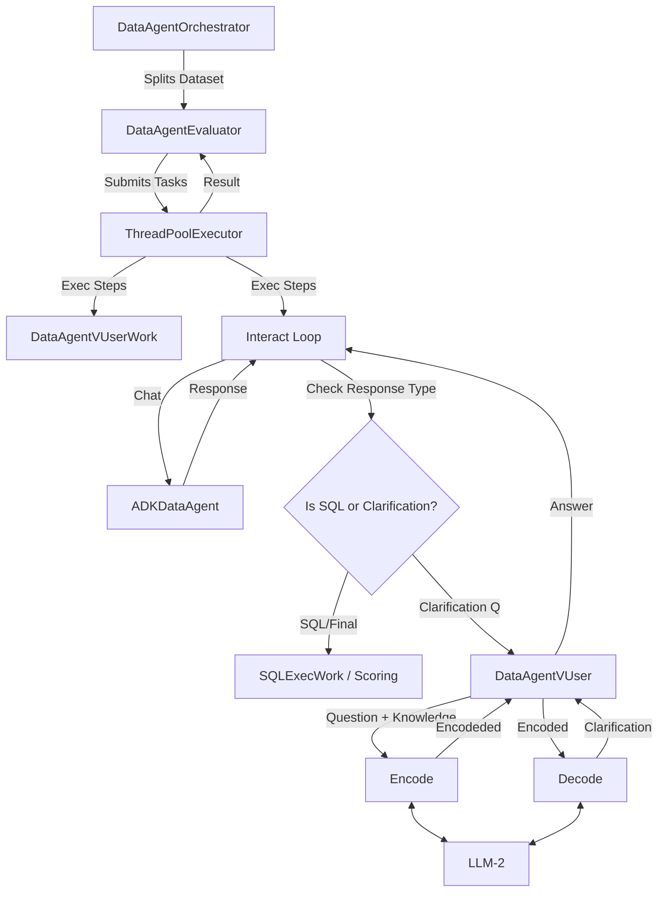

# ADKDataAgent Support in EvalBench

## 1. Introduction
This document specifies the design and implementation of **ADKDataAgent** support within the **EvalBench** framework. The goal is to evaluate "ADKDataAgents"—AI agents capable of interacting with databases (specifically AlloyDB) to answer user queries using tools—in a multi-turn environment where the agent may ask clarification questions.

## 2. Objectives
-   **Evaluate End-to-End**: Test the agent's ability to generate correct SQL or provide correct natural language responses.
-   **Support Disambiguation**: Handle scenarios where the user's query is ambiguous, allowing the agent to ask follow-up questions.
-   **Simulate Users**: Provide a "Virtual User" (VUser) that can intelligently answer the agent's clarification questions based on ground-truth knowledge (i.e., the known correct SQL/outcome).

## 3. Architecture

The architecture relies on an orchestrator and evaluator to manage the lifecycle of tests, in addition to the core loop components.

## 4. Components

### 4.1. DataAgentOrchestrator
**Location**: `evalbench/evaluator/dataagentorchestrator.py`

This is the high-level entry point for running reviews. It extends the base `Orchestrator` class.

-   **Responsibility**:
    -   **Dataset Management**: Breaks down the input dataset by dialect and database.
    -   **Parallel Execution**: Uses a `ThreadPoolExecutor` to run evaluations for different databases in parallel (`eval_runners`).
    -   **DB Connection**: Initializes the core database connections required for the tests.
    -   **Result Aggregation**: Collects and aggregates results from all parallel executions.

### 4.2. DataAgentEvaluator
**Location**: `evalbench/evaluator/dataagentevaluator.py`

This class manages the evaluation logic for a specific dataset subset (e.g., for one database).

-   **Responsibility**:
    -   **State Machine**: Implements the main state machine for processing a single evaluation item (`interact_loop`).
    -   **Steps**:
        1.  `LLM_QUESTION_PROMPT`: Generates the initial prompt.
        2.  `LLM_SQLGEN`: Invokes the `QueryData` generator. Checks if the response is a tool call (SQL) or a question.
        3.  `DISAMBIGUATE`: If a question is asked, runs `DataAgentVUserWork` to get an answer, then loops back to `LLM_QUESTION_PROMPT`.
        4.  `SQL_EXEC`: Executes valid generated SQL against the database.
        5.  `SCORE`: Scores the execution results against ground truth.
    -   **Concurrency**: Uses `MPRunner` (Multi-Processing Runner) logic (using ThreadPools under the hood here) to run different stages of work efficiently.

### 4.3. QueryData Generator
**Location**: `evalbench/generators/models/querydata.py`

This component acts as the interface to the ADKDataAgent. It implements the `QueryGenerator` interface.

-   **Responsibility**:
    -   Manages sessions with the external ADKDataAgent API.
    -   Sends user queries and VUser answers to the agent.
    -   Parses the agent's response to identify:
        -   **Tool Calls**: Specifically `cloud_gda_query_tool_alloydb`.
        -   **Generated SQL**: Extracted from the tool response.
        -   **Disambiguation Questions**: Extracted from the tool response.
        -   **Natural Language Responses**: Standard text responses.

### 4.4. Work Runner (DataAgentVUserWork)
**Location**: `evalbench/work/dataagentvuserwork.py`

This component defines the specific work item for generating a Virtual User response.

-   **Responsibility**:
    -   Invoked by `DataAgentEvaluator` during the `DISAMBIGUATE` step.
    -   Calls the `DataAgentVUser` to generate an answer to a clarification question.
    -   Updates the `eval_result` with the generated text.

### 4.5. Virtual User (DataAgentVUser)
**Location**: `evalbench/evaluator/dataagentvirtualuser.py`

This component simulates the human user. It uses an LLM to generate answers to clarification questions.

-   **Responsibility**:
    -   Take the clarification question from the agent.
    -   Use the "ground truth" (the correct SQL or intended outcome) to formulate an answer.
    -   Return the answer to the Work runner.

-   **Logic (Two-Stage Generation)**:
    1.  **Encode (`VUSER_ENCODE`)**: The model decides on an **Action** (e.g., `labeled("Ambiguity")`, `unlabeled("Segment")`, or `unanswerable()`) based on the provided ground truth and ambiguity info.
    2.  **Decode (`VUSER_DECODE`)**: The model generates the natural language response using the chosen Action and the original clarification question.

## 5. Interaction Flow

1.  **Orchestration**:
    -   `DataAgentOrchestrator` receives a dataset and config.
    -   It spawns `DataAgentEvaluator` instances for each database.

2.  **Evaluation Loop (for each query)**:
    -   **Turn 1**:
        -   `DataAgentEvaluator` sends initial prompt to `QueryData`.
        -   ADKDataAgent processes request.
        -   **Path A (Direct Answer)**: Agent returns SQL. Evaluator moves to `SQL_EXEC` and `SCORE`.
        -   **Path B (Ambiguity)**: Agent returns a `disambiguationQuestion`. Evaluator moves to `DISAMBIGUATE`.

3.  **Disambiguation**:
    -   Evaluator calls `DataAgentVUserWork`.
    -   `DataAgentVUser` analyzes the question vs. Ground Truth.
    -   `DataAgentVUser` generates a clarifying answer (e.g., "Use 2023 data").
    -   Evaluator adds this answer to the conversation history and loops back to **Turn 2**.

4.  **Turn 2**:
    -   `DataAgentEvaluator` sends the user's answer to `QueryData`.
    -   ADKDataAgent uses history to refine SQL.
    -   ADKDataAgent returns final SQL. Evaluator proceeds to execution and scoring.

## 6. Configuration

Configuration is managed via YAML/JSON configs passed to the components.

-   **ADKDataAgent Endpoint**: configured in `querygenerator_config` (`adkapi_server_url`, `agent_id`).
-   **VUser Model**: Configured in `vuser_model_config` (sets the LLM used for the VUser).
-   **Runners**: Number of parallel threads for different stages (`promptgen_runners`, `sqlgen_runners`, etc.) configured in `runners` section.

## 7. Prompts
**Location**: `evalbench/generators/prompts/dataagentinteractuser.py`

Custom prompts are used for the VUser to ensure it stays "in character" and uses the ground truth correctly without revealing it directly if not asked.

-   **Encode Prompt**: Tasks the model to categorize the ambiguity.
-   **Decode Prompt**: Tasks the model to write the response based on the category.
